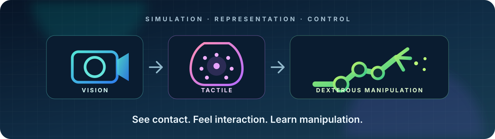
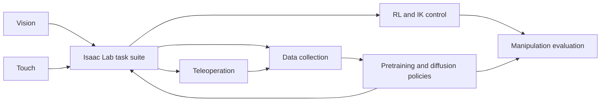

<div align="center">

# ViTacLab

**A research platform for visuo-tactile simulation, representation learning, and dexterous robotic manipulation.**

[Overview](#overview) · [News](#news) · [Quick Start](#quick-start) · [Task Suite](#task-suite) · [ViTacSim](#vitacsim) · [Learning & Data](#learning-and-data) · [Documentation](#documentation)

[](https://github.com/isaac-sim/IsaacLab)
[](source/ViTacLab/setup.py)
[](https://github.com/youlj109/ViTacLab/releases/tag/v0.1-advisor-xense)
[](LICENSE)



</div>

> [!NOTE]
> ViTacLab is under active research development. Runtime support depends on the selected task, Isaac Sim/Isaac Lab version, local assets, and matching policy checkpoints. Run `scripts/list_envs.py` in your installed checkout before large-scale experiments.

<a id="overview"></a>

## 🔎 Overview

ViTacLab is an external [Isaac Lab](https://github.com/isaac-sim/IsaacLab) extension for studying how robots can combine vision and touch. It brings tactile simulation, dexterous manipulation environments, representation pretraining, policy learning, data collection, and teleoperation into one repository without requiring a fork of Isaac Lab.

### What is included

| Area | Capabilities |
|---|---|
| **Visuo-tactile sensing** | Tactile RGB, contact position, normal force, shear force, sensor-pose records, and camera observations |
| **Robots and hands** | Franka, UR10e + Shadow Hand, standalone Shadow Hand, and dual-arm/dual-hand configurations |
| **Manipulation** | In-hand reorientation, pickup, pouring, handover, peg insertion, gear meshing, nut threading, bottle-cap unscrewing, and blind tactile tasks |
| **Learning** | RSL-RL, full-joint RL, IK-assisted control, Diffusion Policy, ViTacDP, and tactile-property pretraining |
| **Data and control** | RL rollout collection, scripted/full-trajectory collection, NPZ-to-Zarr conversion, GUI teleoperation, and camera-based teleoperation |



<a id="news"></a>

## 🔥 News

- **2026-09-09** — Integrated the ViTac 0.1 data and policy pipeline and improved contact-edge smoothing in tactile depth-to-RGB rendering.
- **2026-09-02** — Released the ViTacSim advisor pipeline for Xense normal-force and marker validation.

<a id="quick-start"></a>

## 🛠️ Quick Start

The currently documented reference setup is **Isaac Sim 5.1.0 + Isaac Lab 2.3.2**. Install Isaac Lab first using its [official installation guide](https://isaac-sim.github.io/IsaacLab/main/source/setup/installation/index.html), then keep ViTacLab in a separate directory.

```bash
git clone https://github.com/youlj109/ViTacLab.git
cd ViTacLab

# Run this with a Python interpreter that can already import Isaac Lab.
python -m pip install -e source/ViTacLab
```

List the environments contributed by this extension:

```bash
python scripts/list_envs.py
```

Most dexterous tasks reference robot/object USDs and tactile calibration assets that are not stored in this public code repository. There is not yet a universal asset downloader, so obtain the corresponding task asset pack separately before launching those tasks. Then start a one-environment zero-action check with an ID printed above (close the simulator window or press `Ctrl+C` to stop):

```bash
python scripts/zero_agent.py \
  --task YOUR_TASK_ID \
  --num_envs 1 --enable_cameras
```

For a short Chinese installation guide, see [`docs/QUICK_INSTALL.md`](docs/QUICK_INSTALL.md). Tasks that render cameras or tactile RGB generally require `--enable_cameras`; see the [headless/camera guide](docs/enable_cameras_headless_rl.md).

<a id="task-suite"></a>

## 🤖 Task Suite

ViTacLab organizes environments by sensing and manipulation complexity. The table below shows representative families rather than a runtime-support guarantee for every configuration.

| Family | Representative tasks | Example environment ID |
|---|---|---|
| **Tactile pretraining** | Mass, friction, and pose-oriented sensor pretraining | `Isaac-GelsightFinger-MassPretrain-Direct-v0` |
| **Forge manipulation** | Peg insertion, gear meshing, and nut threading | `Isaac-Forge-PegInsert-Direct-v0` |
| **Single-hand dexterity** | Cube reorientation, pickup, pouring, and blind retrieval | `Isaac-UR10eShadowHand-Pickup-Direct-v0` |
| **Dual-hand coordination** | Handover, bimanual stabilization, pouring, and peg tasks | `Isaac-UR10e-Dual-Shadow-Hand-Over-Direct-v0` |
| **Tactile-first challenges** | Blind grasping, classification, bin drop, and in-hand manipulation | `Isaac-UR10eShadowHand-BlindGrasp-Direct-v0` |

An implementation snapshot with observation contracts and policy compatibility notes is available in [`docs/ENVIRONMENT_MATRIX.md`](docs/ENVIRONMENT_MATRIX.md). It may lag active registrations and CLI changes, so verify task IDs with `python scripts/list_envs.py` and command options with `--help` in your checkout.

<a id="vitacsim"></a>

## ✋ ViTacSim

ViTacSim connects contact geometry and PhysX signals to tactile RGB and force observations. The repository includes the simulation path, calibration tools, marker simulation, and validation utilities; laboratory videos and fitted calibration artifacts remain local by design.

The current stable snapshot is available on branch [`release/advisor-xense-v0.1`](https://github.com/youlj109/ViTacLab/tree/release/advisor-xense-v0.1) and tag [`v0.1-advisor-xense`](https://github.com/youlj109/ViTacLab/releases/tag/v0.1-advisor-xense).

<details>
<summary><strong>Reproduce the Xense advisor calibration and validation flow</strong></summary>

### Prerequisites

- Isaac Sim and Isaac Lab in a working Python environment.
- ViTacLab installed with `python -m pip install -e source/ViTacLab`.
- Local tactile recordings under `data/calibration/tactile/`.
- Render assets installed under [`xense_lab_data/`](source/ViTacLab/ViTacLab/assets/sensor/tacsl_sensor/xense_lab_data/README.md).
- Optional external [Taxim](https://github.com/TacTip/Taxim) checkout for `polycalib` fitting.

### Calibration → validation

```bash
# Import real frames and install the background / resting-marker assets.
python3 scripts/calibration/import_advisor_tactile_videos.py --install-bg

# Generate the initial simulated normal-force sweep.
bash bash_command/run_vitacsim_calibration_sweep_dual.sh

# Fit RGB and marker parameters jointly.
bash bash_command/run_task2_advisor_calibration.sh

# Re-run the sweep with fitted parameters and generate validation panels.
SKIP_EXISTING=0 \
FITTED_PARAMS=data/calibration/tactile/fitted_params.json \
  bash bash_command/run_vitacsim_calibration_sweep_dual.sh
bash bash_command/run_task3_advisor_validation.sh
```

Expected local outputs include `logs/vitacsim_validation/task3/panel_nf_three_way.png` and `logs/vitacsim_validation/task3/TASK3_VALIDATION_REPORT.md`.

</details>

Core technical notes:

- [ViTacSim principles](docs/VITACSIM_PRINCIPLES.md)
- [Calibration protocol](docs/VITACSIM_CALIBRATION.md)
- [Marker simulation](docs/VITACSIM_MARKER_SIMULATION.md)
- [PhysX validation](docs/VITACSIM_PHYSX_VALIDATION.md)

<a id="learning-and-data"></a>

## 🧠 Learning & Data

| Workflow | Entry points | Guide |
|---|---|---|
| **RSL-RL** | `scripts/rsl_rl/full_rl/`, `ik_rl/`, `full_ik/` | [Training and playback](scripts/rsl_rl/README.md) · [Quick commands](scripts/rsl_rl/QUICKSTART.md) |
| **Data collection** | RL rollout, IK, full trajectory, manual capture | [Unified collection guide](scripts/data_collection/README.md) |
| **Policy inference** | `scripts/policy/play_policy.py` | [Script reference](docs/SCRIPT_USAGE.md) |
| **Diffusion policies** | `policy/Diffusion_Policy/`, `policy/ViTacDP/`, `policy/Ours/` | [Policy notes](policy/README.md) |
| **Teleoperation** | Camera/MediaPipe + ZMQ and GUI tools | [Video teleoperation](scripts/teleoperation/video_teleop/README.md) · [Quick start](scripts/teleoperation/video_teleop/QUICK_START.md) |

Example full-joint RSL-RL training command:

```bash
python scripts/rsl_rl/full_rl/train.py \
  --task Isaac-UR10eShadowHand-Pickup-Direct-v0 \
  --num_envs 256 --headless --device cuda:0
```

Checkpoints are task-specific: camera order, tactile type and count, state/action dimensions, and action semantics must match the configuration used during training.

<a id="documentation"></a>

## 📚 Documentation

| Topic | Document |
|---|---|
| Installation | [Quick install (中文)](docs/QUICK_INSTALL.md) |
| Environment inventory (development snapshot) | [Environment and compatibility matrix](docs/ENVIRONMENT_MATRIX.md) |
| Executable scripts and CLI options | [Script usage reference](docs/SCRIPT_USAGE.md) |
| Data collection | [Unified collection guide](scripts/data_collection/README.md) |
| RSL-RL / IK-RL / Full-IK | [Training guide](scripts/rsl_rl/README.md) · [Team modification guide](docs/ik_rl_modification_guide.md) |
| Video teleoperation | [User guide](scripts/teleoperation/video_teleop/README.md) · [Package internals](source/video_teleop/docs/README.md) |
| Cameras and headless execution | [`enable_cameras` guide](docs/enable_cameras_headless_rl.md) |
| ViTacSim | [Principles](docs/VITACSIM_PRINCIPLES.md) · [Calibration](docs/VITACSIM_CALIBRATION.md) · [Markers](docs/VITACSIM_MARKER_SIMULATION.md) · [PhysX validation](docs/VITACSIM_PHYSX_VALIDATION.md) |

<a id="repository-layout"></a>

## 🗂️ Repository Layout

```text
ViTacLab/
├── source/ViTacLab/       # Isaac Lab extension, environments, robots, sensors
├── source/video_teleop/   # Camera / MediaPipe sender-side package
├── scripts/               # Training, collection, teleoperation, calibration, demos
├── policy/                # Diffusion Policy and ViTacDP implementations
├── docs/                  # Installation, matrices, design and validation notes
├── bash_command/          # Reproduction and convenience launchers
└── third_party/           # External dependency notes (not vendored)
```

> [!IMPORTANT]
> Robot assets, lab calibration recordings, fitted parameters, logs, videos, and checkpoints may be excluded from Git. Follow the task-specific documentation and [`third_party/README.md`](third_party/README.md) before reproducing an experiment.

<details>
<summary><strong>Development and IDE setup</strong></summary>

### Formatting

```bash
python -m pip install pre-commit
pre-commit run --all-files
```

### VS Code

Run **Tasks: Run Task → `setup_python_env`**, then provide the absolute path to the Isaac Sim installation. If Pylance indexes too many Omniverse packages, remove unused paths from `python.analysis.extraPaths`.

### Omniverse extension

Open **Window → Extensions → Settings**, add this repository's `source` directory to the extension search paths, refresh, and enable ViTacLab under **Third Party**.

</details>

## 🤝 Contributing

Bug reports, task proposals, and reproducibility feedback are welcome through [GitHub Issues](https://github.com/youlj109/ViTacLab/issues). Keep new task documentation close to its canonical configuration and include a minimal smoke-test command whenever possible.

## 📄 License

ViTacLab is released under the [Apache License 2.0](LICENSE). Third-party projects and external assets retain their own licenses and terms.
