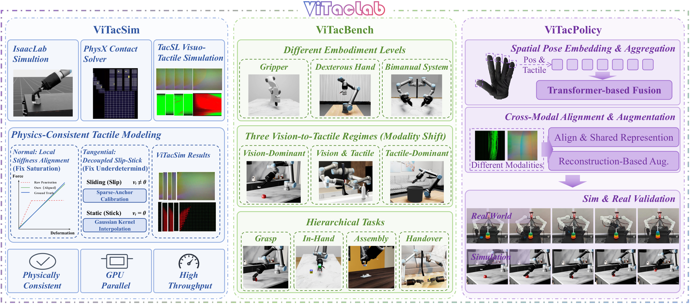
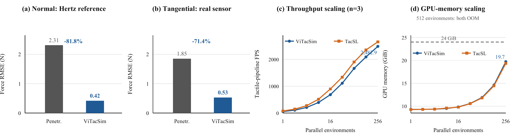
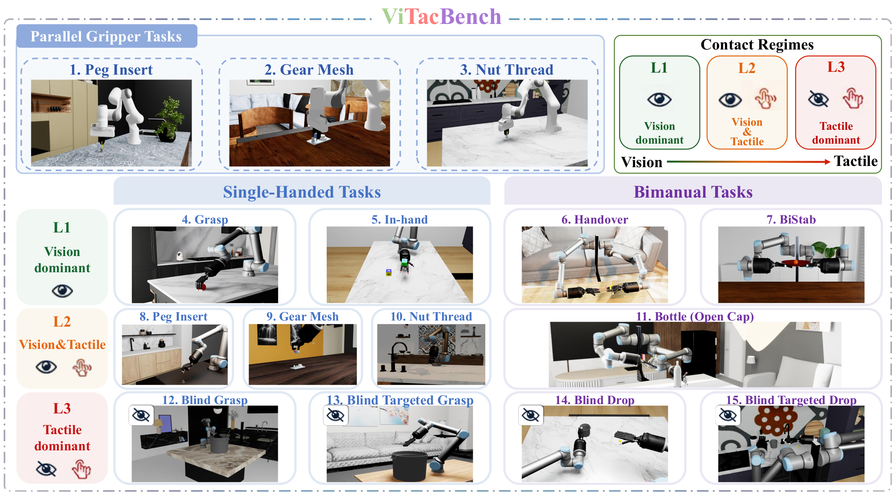
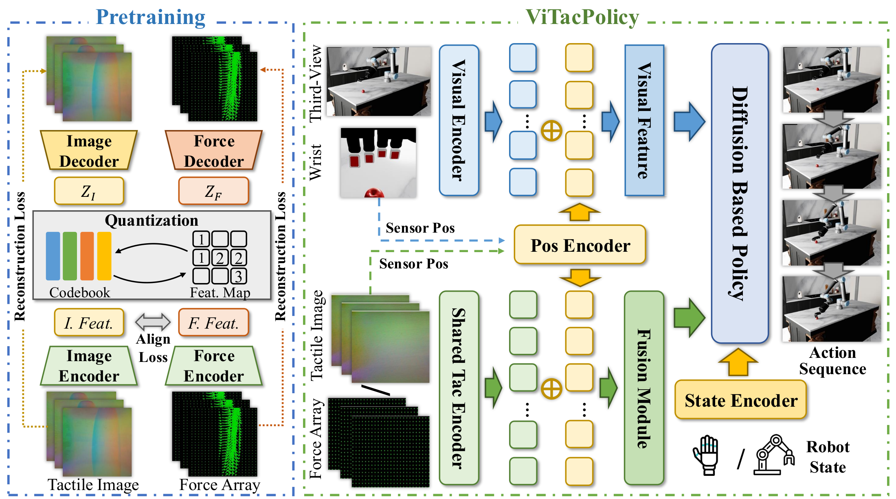

<div align="center">

# ViTacLab

**Physically Consistent Visuo-Tactile Simulation, Benchmarking, and Representation Learning for Robotic Manipulation**

[Project Website](https://youlj109.github.io/ViTacLab/) · [Paper](#paper) · [Highlights](#overview) · [Benchmark](#vitacbench) · [Results](#results) · [Quick Start](#quick-start) · [Documentation](#documentation) · [Citation](#citation)

[](https://youlj109.github.io/ViTacLab/)
[](https://github.com/isaac-sim/IsaacLab)
[](source/ViTacLab/setup.py)
[](#paper)
[](https://github.com/youlj109/ViTacLab/releases/tag/v0.1-advisor-xense)
[](LICENSE)

<a href="docs/media/paper/vitaclab-teaser.png">
  
</a>

</div>

> [!NOTE]
> ViTacLab is under active research development. Runtime support depends on the task, Isaac Sim/Isaac Lab version, local assets, and matching policy checkpoints. Run `scripts/list_envs.py` in your installed checkout before large-scale experiments.

<a id="paper"></a>

## 📄 Paper

**ViTacLab: Physically Consistent Visuo-Tactile Simulation, Benchmarking, and Representation Learning for Robotic Manipulation**

<div align="center">

Linjing You<sup>*</sup>, Zeming Yang<sup>*</sup>, Zhenhao Shen<sup>*</sup>, Shengqiang Xu<sup>*</sup>, Guanda Li, Wenxuan Li, Jasper Lu, Jingkai Xu, Shawn Xie, Zhu Junjie, Siyu Wu, Ruochong Li, Jian Liu, Changhao Zhang, Weiqiang Wang, Chen Xie, Zeyi Li, Ruihai Wu<sup>†</sup>

<sup>*</sup> Equal contribution. <sup>†</sup> Corresponding author: [Ruihai Wu](mailto:wuruihai@pku.edu.cn).

**Paper link and citation metadata: coming soon.**

</div>

ViTacLab is a full-stack framework that connects physically consistent tactile simulation, a hierarchical visuo-tactile manipulation benchmark, and sensor-agnostic representation learning. It is designed to study how touch complements vision across parallel grippers, dexterous hands, and bimanual systems.

<a id="overview"></a>

## 🔎 Overview

| | Component | What it contributes |
|---|---|---|
| ✋ | **[ViTacSim](#vitacsim)** | PhysX-anchored global sparse forces, local dense force arrays, and tactile images with normal/tangential consistency corrections |
| 🤖 | **[ViTacBench](#vitacbench)** | 15 tasks across 3 embodiments and 3 regimes, progressing from vision-dominant to tactile-dominant manipulation |
| 🧠 | **[ViTacPolicy](#vitacpolicy)** | Pose-conditioned aggregation of heterogeneous tactile sensors and shared-codebook cross-modal pretraining |

| 3 tactile modalities | 15 benchmark tasks | 3 robot embodiments | 2,482.9 tactile-pipeline FPS at 256 environments |
|:---:|:---:|:---:|:---:|
| Sparse force · dense force · tactile image | Contact-rich manipulation | Gripper · dexterous hand · bimanual | Reported on an RTX 4090D |

### Code and artifact availability

| Area | Status in this public checkout |
|---|---|
| **Extension smoke run** | Available with the Isaac Lab cart-pole template; no paper assets required |
| **ViTacSim & ViTacBench** | Simulator and environment code/configuration are included; most paper-scale tasks require external robot, object, and calibration assets |
| **ViTacPolicy** | Downstream policy/encoder code and pretrained-backbone loader hooks are included under [`policy/Ours/`](policy/Ours/); shared-codebook pretraining code and pretrained checkpoints are not included |
| **Full paper reproduction** | Not yet packaged as a single public release; the current advisor release is a calibration/validation snapshot only |

### News

- **2026-09-09** — Integrated the ViTac 0.1 data and policy pipeline and improved contact-edge smoothing in tactile depth-to-RGB rendering.
- **2026-09-02** — Released the ViTacSim advisor pipeline for Xense normal-force and marker validation.

<a id="vitacsim"></a>

## ✋ ViTacSim

ViTacSim uses PhysX solver contacts as physical anchors while retaining dense, GPU-parallel tactile observations. At each simulation step, it exposes contact observations through three complementary representations:

- **Global sparse force lattice (`T_sparse`)** for global contact topology and solver-wrench anchoring.
- **Local dense force array (`T_dense`)** for spatially resolved normal and tangential forces.
- **Local tactile image (`T_img`)** for vision-compatible tactile sensing.

Its correction pipeline combines local stiffness alignment for the normal response, decoupled slip–stick tangential reconstruction, and a joint projection that preserves the sparse PhysX force/torque while enforcing local Coulomb friction constraints.

<p align="center">
  <a href="docs/media/paper/sim-validation.png">
    
  </a>
  <br>
  <sub>Force fidelity (a–b) and parallel throughput/memory scaling (c–d), as reported in the manuscript. Click for the full-resolution figure.</sub>
</p>

| Evaluation | Reported change | Improvement |
|---|---:|---:|
| Normal-force RMSE against a Hertzian reference | Penetration-only 2.31 → **ViTacSim 0.42 N** | **81.8% lower** |
| Tangential-force RMSE in controlled real-sensor sliding | Penetration-only 1.85 → **ViTacSim 0.53 N** | **71.4% lower** |
| Tactile-pipeline throughput | ViTacSim 56.0 (1 env) → **2,482.9 FPS (256 envs)** | **44.3× throughput increase** |

The throughput experiment used an Intel Core Ultra 9 285K, an NVIDIA RTX 4090D, `20 × 25 × 3` force arrays, and `320 × 240 × 3` tactile images. At 256 environments, the reported throughput gap to TacSL narrows to 6.4%, with 20,184 MiB memory usage (376 MiB, or 1.9%, above TacSL).

<a id="vitacbench"></a>

## 🤖 ViTacBench

ViTacBench varies both **embodiment** (parallel gripper, single dexterous hand, and bimanual manipulation) and **modality dependence** (vision-dominant, vision-and-touch, and tactile-dominant). This evaluates embodiment complexity and the vision-to-touch shift as complementary axes instead of restricting tactile manipulation to gripper-only tasks.

<p align="center">
  <a href="docs/media/paper/vitacbench.png">
    
  </a>
  <br>
  <sub>ViTacBench spans 15 tasks along embodiment and modality-dependence axes. Click for the full-resolution figure.</sub>
</p>

| Benchmark block | Figure task # | Tasks |
|---|---:|---|
| **Parallel gripper** | 1–3 | Peg Insert · Gear Mesh · Nut Thread |
| **L1 · Vision-dominant** | 4–7 | Grasp · In-hand · Handover · BiStab |
| **L2 · Vision & tactile** | 8–11 | Peg Insert · Gear Mesh · Nut Thread · Bottle (Open Cap) |
| **L3 · Tactile-dominant** | 12–15 | Blind Grasp · Blind Targeted Grasp · Blind Drop · Blind Targeted Drop |

In Level 3, wrist-camera observations are fully masked and the remaining global view is occluded by design; policies receive no direct wrist-view object pixels. These tasks remain challenging and are intended as an open testbed rather than a solved benchmark.

> [!TIP]
> The table above follows the numbered 15-task layout in the paper's ViTacBench figure; those numbers do not map one-to-one to Gym environment IDs. The repository also contains additional registered environments and development variants. Treat `python scripts/list_envs.py` as the source of truth for the installed task registry. The [environment matrix](docs/ENVIRONMENT_MATRIX.md) is a development snapshot and may lag active registrations.

<a id="vitacpolicy"></a>

## 🧠 ViTacPolicy

ViTacPolicy is built for tactile sensors whose modality, count, and placement can change across embodiments. Each sensor observation is encoded with a modality-specific encoder and combined with a learned embedding of its 9D pose (3D position plus 6D orientation). A Transformer and pooling layer then produce a fixed-size tactile representation for a policy conditioned on RGB, touch, and proprioception.

<p align="center">
  <a href="docs/media/paper/vitacpolicy.png">
    
  </a>
  <br>
  <sub>Variable-layout tactile aggregation and cross-modal representation pretraining.</sub>
</p>

For cross-modal pretraining, a two-stream VQ-VAE gives dense force arrays and tactile images separate encoders/decoders but a **shared discrete codebook**. Reconstruction, codebook, commitment, and global-alignment losses encourage both modalities to share a transferable tactile latent space.

> [!IMPORTANT]
> The current checkout includes ViTacPolicy's downstream tactile encoders, policy training path, and pretrained-backbone loading hooks in [`policy/Ours/`](policy/Ours/). The shared-codebook VQ-VAE training pipeline and the paper's pretrained checkpoints are not included in this public snapshot.

<a id="results"></a>

## 📊 Representative Results

The manuscript evaluates simulation policies with five random seeds and 200 evaluation episodes per seed. The table below reports representative success rates (%); an em dash means the baseline was not evaluated for that task.

| Method | Peg Insert | Gear Mesh | Nut Thread | Grasp | Bottle Open | Blind Grasp |
|---|---:|---:|---:|---:|---:|---:|
| Diffusion Policy (DP) | 16.0 | 39.5 | 38.5 | 29.0 | 0.0 | 0.0 |
| ADM-DP | 20.0 | 44.5 | 34.0 | — | — | — |
| ViTacFormer | — | — | — | 31.0 | 2.0 | 1.5 |
| ViTacPolicy without pretraining | 21.0 | **72.0** | 38.0 | 82.5 | **5.0** | 2.0 |
| **ViTacPolicy** | **24.0** | 69.0 | **44.0** | **90.0** | 4.5 | **3.0** |

The full model leads on four of the six representative tasks; the no-pretraining variant is higher on Gear Mesh and Bottle Open, and all Blind Grasp results remain at or below 3%. The results show task-dependent gains while confirming that tactile-dominant manipulation remains far from solved.

### Real-robot gripper transfer

The paper also reports 50 physical trials per task and condition:

| Method | Peg Insert | Nut Thread | Gear Mesh | Average |
|---|---:|---:|---:|---:|
| Penetration-only tactile model | 20% | 60% | 54% | 44.7% |
| ViTacPolicy without pretraining | 22% | 66% | 58% | 48.7% |
| **ViTacPolicy** | **38%** | **80%** | **66%** | **61.3%** |

Individual task-wise Fisher tests comparing the full and no-pretraining models are not statistically significant. Their aggregate Cochran–Mantel–Haenszel comparison reports an odds ratio of 1.82 (95% CI 1.11–2.98, `p = 0.018`).

<a id="quick-start"></a>

## 🛠️ Quick Start

The currently documented reference setup is **Isaac Sim 5.1.0 + Isaac Lab 2.3.2**. Install Isaac Lab first using its [official installation guide](https://isaac-sim.github.io/IsaacLab/main/source/setup/installation/index.html), then keep ViTacLab in a separate directory.

```bash
git clone https://github.com/youlj109/ViTacLab.git
cd ViTacLab

# Use a Python interpreter that can already import Isaac Lab.
python -m pip install -e source/ViTacLab
```

Verify that the extension loads with the asset-independent template task. This is an interactive zero-action loop; press `Ctrl+C` after initialization:

```bash
python scripts/zero_agent.py \
  --task Template-Vitaclab-Direct-v0 \
  --num_envs 1 --headless
```

Then list the environments contributed by the extension:

```bash
python scripts/list_envs.py
```

The template verifies installation and registry wiring, not the paper's tactile stack. Most manipulation tasks reference robot/object USDs and tactile calibration assets that are not stored in this public repository, and a universal asset download link is not currently published. After installing the corresponding task assets, start a one-environment interactive run with an ID printed by `list_envs.py` (close the simulator window or press `Ctrl+C` to stop):

```bash
python scripts/zero_agent.py \
  --task YOUR_TASK_ID \
  --num_envs 1 --enable_cameras
```

For a short Chinese installation guide, see [`docs/QUICK_INSTALL.md`](docs/QUICK_INSTALL.md). Tasks that render cameras or tactile RGB generally require `--enable_cameras`; see the [headless/camera guide](docs/enable_cameras_headless_rl.md).

<a id="reproduction"></a>

## 🧪 ViTacSim Reproduction Snapshot

The public [`release/advisor-xense-v0.1`](https://github.com/youlj109/ViTacLab/tree/release/advisor-xense-v0.1) branch and [`v0.1-advisor-xense`](https://github.com/youlj109/ViTacLab/releases/tag/v0.1-advisor-xense) tag provide a calibration-and-validation snapshot. They are not a complete release of every paper experiment.

<details>
<summary><strong>Reproduce the Xense advisor calibration and validation flow</strong></summary>

### Prerequisites

- Isaac Sim and Isaac Lab in a working Python environment.
- ViTacLab installed with `python -m pip install -e source/ViTacLab`.
- Local tactile recordings under `data/calibration/tactile/`.
- Render assets installed under [`xense_lab_data/`](source/ViTacLab/ViTacLab/assets/sensor/tacsl_sensor/xense_lab_data/README.md).
- Optional external [Taxim](https://github.com/Robo-Touch/Taxim) checkout for `polycalib` fitting.

### Calibration → validation

```bash
# Import real frames and install the background / resting-marker assets.
python3 scripts/calibration/import_advisor_tactile_videos.py --install-bg

# Generate the initial simulated normal-force sweep.
bash bash_command/run_vitacsim_calibration_sweep_dual.sh

# Fit RGB and marker parameters jointly.
bash bash_command/run_task2_advisor_calibration.sh

# Re-run the sweep with fitted parameters and generate validation panels.
SKIP_EXISTING=0 \
FITTED_PARAMS=data/calibration/tactile/fitted_params.json \
  bash bash_command/run_vitacsim_calibration_sweep_dual.sh
bash bash_command/run_task3_advisor_validation.sh
```

Expected local outputs include `logs/vitacsim_validation/task3/panel_nf_three_way.png` and `logs/vitacsim_validation/task3/TASK3_VALIDATION_REPORT.md`.

</details>

Core technical notes:

- [ViTacSim principles](docs/VITACSIM_PRINCIPLES.md)
- [Calibration protocol](docs/VITACSIM_CALIBRATION.md)
- [Marker simulation](docs/VITACSIM_MARKER_SIMULATION.md)
- [PhysX validation](docs/VITACSIM_PHYSX_VALIDATION.md)

<a id="learning-and-data"></a>

## 🧰 Learning & Data Workflows

| Workflow | Entry points | Guide |
|---|---|---|
| **RSL-RL** | `scripts/rsl_rl/full_rl/`, `ik_rl/`, `full_ik/` | [Training and playback](scripts/rsl_rl/README.md) · [Quick commands](scripts/rsl_rl/QUICKSTART.md) |
| **Data collection** | RL rollout, IK, full trajectory, manual capture | [Unified collection guide](scripts/data_collection/README.md) |
| **Policy inference** | `scripts/policy/play_policy.py` | [Script reference](docs/SCRIPT_USAGE.md) |
| **ViTacPolicy (downstream)** | `policy/Ours/` | [Training code](policy/Ours/) · [Pretrained-backbone loader](policy/Ours/diffusion_policy/common/pretrained_tac_loader.py) |
| **Other diffusion policies** | `policy/Diffusion_Policy/`, `policy/ViTacDP/` | [Policy notes](policy/README.md) |
| **Teleoperation** | Camera/MediaPipe + ZMQ and GUI tools | [Video teleoperation](scripts/teleoperation/video_teleop/README.md) · [Quick start](scripts/teleoperation/video_teleop/QUICK_START.md) |

Example full-joint RSL-RL training command:

```bash
python scripts/rsl_rl/full_rl/train.py \
  --task Isaac-UR10eShadowHand-Pickup-Direct-v0 \
  --num_envs 256 --headless --device cuda:0
```

Checkpoints are task-specific: camera order, tactile type and count, state/action dimensions, and action semantics must match the configuration used during training.

<a id="documentation"></a>

## 📚 Documentation

| Topic | Document |
|---|---|
| Project website | [Website](https://youlj109.github.io/ViTacLab/) · [Maintenance notes](docs/PROJECT_WEBSITE.md) |
| Installation | [Quick install (中文)](docs/QUICK_INSTALL.md) |
| Environment inventory (development snapshot) | [Environment and compatibility matrix](docs/ENVIRONMENT_MATRIX.md) |
| Executable scripts and CLI options | [Script usage reference](docs/SCRIPT_USAGE.md) |
| Data collection | [Unified collection guide](scripts/data_collection/README.md) |
| RSL-RL / IK-RL / Full-IK | [Training guide](scripts/rsl_rl/README.md) · [Team modification guide](docs/ik_rl_modification_guide.md) |
| Video teleoperation | [User guide](scripts/teleoperation/video_teleop/README.md) · [Package internals](source/video_teleop/docs/README.md) |
| Cameras and headless execution | [`enable_cameras` guide](docs/enable_cameras_headless_rl.md) |
| ViTacSim | [Principles](docs/VITACSIM_PRINCIPLES.md) · [Calibration](docs/VITACSIM_CALIBRATION.md) · [Markers](docs/VITACSIM_MARKER_SIMULATION.md) · [PhysX validation](docs/VITACSIM_PHYSX_VALIDATION.md) |

<a id="repository-layout"></a>

## 🗂️ Repository Layout

```text
ViTacLab/
├── source/ViTacLab/       # Isaac Lab extension, environments, robots, sensors
├── source/video_teleop/   # Camera / MediaPipe sender-side package
├── scripts/               # Training, collection, teleoperation, calibration, demos
├── policy/                # Downstream policy implementations and loader hooks
├── docs/                  # Installation, matrices, design and validation notes
├── bash_command/          # Reproduction and convenience launchers
└── third_party/           # External dependency notes (not vendored)
```

> [!IMPORTANT]
> Robot assets, lab calibration recordings, fitted parameters, logs, videos, and checkpoints may be excluded from Git. Follow the task-specific documentation and [`third_party/README.md`](third_party/README.md) before reproducing an experiment.

<details>
<summary><strong>Development and IDE setup</strong></summary>

### Formatting

```bash
python -m pip install pre-commit
pre-commit run --all-files
```

### VS Code

Run **Tasks: Run Task → `setup_python_env`**, then provide the absolute path to the Isaac Sim installation. If Pylance indexes too many Omniverse packages, remove unused paths from `python.analysis.extraPaths`.

### Omniverse extension

Open **Window → Extensions → Settings**, add this repository's `source` directory to the extension search paths, refresh, and enable ViTacLab under **Third Party**.

</details>

## ⚠️ Current Scope and Limitations

The current simulator does not fully model deformable objects, adhesion, wear, or large elastomer deformation, and it assumes contacts fall within active tactile patches. Dense spatial-field error, tactile-image fidelity, wrench residuals across broader contact distributions, and controlled parameter sensitivity remain open evaluation areas. Level 3 tactile-dominant tasks also leave substantial room for progress.

<a id="citation"></a>

## 📝 Citation

The official BibTeX entry will be added when the public preprint record and identifier are available.

## 🤝 Contributing

Bug reports, task proposals, and reproducibility feedback are welcome through [GitHub Issues](https://github.com/youlj109/ViTacLab/issues). Keep new task documentation close to its canonical configuration and include a minimal smoke-test command whenever possible.

## 📜 License

ViTacLab is released under the [Apache License 2.0](LICENSE). Third-party projects and external assets retain their own licenses and terms.
