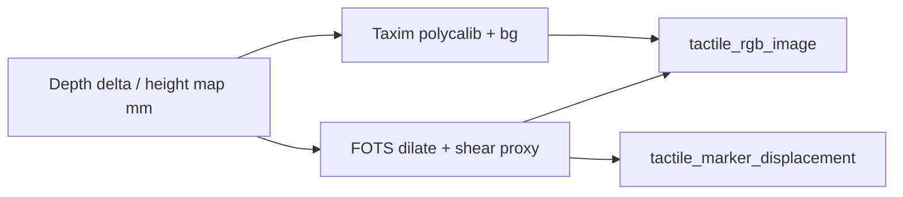

# ViTacSim Marker 仿真原理

本文档说明 **TacEx / FOTS** 中 marker（凝胶内标记点）的仿真思路，以及 ViTacLab 如何在 Taxim RGB 之上叠加 marker，并区分 **GelSight** 与实验室 **Xense** 两种布局。

配套文档：[`VITACSIM_PRINCIPLES.md`](VITACSIM_PRINCIPLES.md)

---

## 1. 什么是 marker

光学触觉传感器（GelSight、GelSight Mini、Xense 等）在透明凝胶层内嵌入 **高对比度标记点**。接触时凝胶形变，标记点在图像平面内 **平移**；结合 Taxim 渲染的 RGB 形貌，可估计 **法向压痕 + 切向滑动/扭转**。

| 传感器 | 典型 marker 外观 | ViTacSim 配置 |
|--------|------------------|---------------|
| GelSight / Mini | 稀疏 **黑色圆点**，规则网格 | `marker_pattern="gelsight"`（10×10） |
| 实验室 Xense | 更密 **彩色点**，奇偶行错开 | `marker_pattern="xense"`（14×14 交错，绿色近似） |

ViTacSim 的 Xense 布局为 **工程近似**（网格密度/颜色/半径），后续可用真机标定图替换 `PATTERN_SPECS` 中的 rest 位置与外观。

---

## 2. TacEx 中的两路渲染（Taxim + FOTS）

TacEx（arXiv:2411.04776）将触觉图像拆成：

1. **Taxim** — 由 **高度图 / 深度差** 经多项式标定得到 **RGB 形貌**（与 ViTacSim 现有 `GelsightRender` 一致）。
2. **FOTS**（Fast Optical Tactile Simulation, arXiv:2404.19217）— 由同一高度图与接触几何得到 **marker 位移场**；策略侧常用 marker 位移而非原始 RGB。

FOTS 核心思想（简化）：

- 从高度图提取 **接触中心** 及局部压痕深度。
- 对每个 marker，用接触点加权 **dilate** 位移（论文 Eq. 11 的高斯核形式）。
- 物体 **旋转/切向滑动** 会引入额外 marker 运动；完整 FOTS 使用接触 patch 姿态；ViTacSim 在无 patch 姿态时用 **高度图梯度 shear proxy** 近似切向分量。



**ViTacSim 顺序**：先 Taxim 合成 RGB，再按 FOTS 位移 **绘制 marker 圆点** 覆盖到 RGB 上（与 TacEx 可视化管线一致）。

---

## 3. 代码位置与配置

| 组件 | 路径 |
|------|------|
| Marker 算法 | `assets/sensor/tacsl_sensor/visuotactile_marker.py` |
| Taxim + marker 合成 | `assets/sensor/tacsl_sensor/visuotactile_render.py` |
| 配置项 | `GelSightRenderCfg` in `visuotactile_sensor_cfg.py` |
| 传感器输出 | `VisuoTactileSensorData.tactile_marker_displacement` |

### 3.1 启用 marker

在 `GelSightRenderCfg`（或 `calibrated_gelsight_r15_cfg`）中：

```python
from ViTacLab.assets.sensor.tacsl_sensor.gelsight_calibrated_cfg import calibrated_gelsight_r15_cfg

render_cfg = calibrated_gelsight_r15_cfg(
    enable_marker_simulation=True,
    marker_pattern="gelsight",  # 或 "xense"
)
```

主要参数：

| 参数 | 默认 | 含义 |
|------|------|------|
| `enable_marker_simulation` | `False` | 总开关 |
| `marker_pattern` | `gelsight` | `gelsight` / `xense` / `none` |
| `marker_lambda_d` | `0.0025` | FOTS dilate 高斯宽度 |
| `marker_displacement_gain` | `0.35` | 法向压痕引起的位移幅度 |
| `marker_shear_gain` | `8.0` | 梯度 shear 代理增益 |
| `marker_deadband_mm` | `0.02` | 忽略弱接触的 height 阈值（Taxim mm） |
| `marker_blend_alpha` | `0.92` | marker 颜色与底图混合 |

### 3.2 输出

- `tactile_rgb_image`：Taxim RGB **含 marker 叠加**（开启时）。
- `tactile_marker_displacement`：形状 `(num_envs, M, 2)`，像素位移 `(dx, dy)`，与 `tri_modal["marker_displacement"]` 同步。

---

## 4. GelSight vs Xense 实现差异

两者共用同一套 FOTS dilate + shear 公式，区别仅在 **rest 布局与绘制**（`PATTERN_SPECS`）：

| | GelSight | Xense（实验室近似） |
|---|----------|---------------------|
| 网格 | 10×10 规则 | 14×14 |
| 错行 | 否 | 奇数行半格 stagger |
| 颜色 | 黑 `(0,0,0)` | 绿 `(40,210,120)` |
| 半径 | 4 px | 2.5 px |
| marker 数 M | 100 | 196 |

真机 Xense 若为非方阵或自定义印刷，应更新 `MarkerPatternSpec` 或导入 FOTS 官方标定（[Rancho-zhao/FOTS](https://github.com/Rancho-zhao/FOTS)）中的 rest 坐标。

---

## 5. 与 ViTacSim 验证路线图的关系

Rebuttal / 共谋路线图中 **Task 1**：在 ViTacSim RGB 上补齐 TacEx 级 marker 层（本文档 + demo）。

后续 **Task 2**（RGB + marker **联合标定**）：多权重压痕 + 网格/蚁群优化，需同时拟合 Taxim 与 marker 位移，而非仅使用当前默认增益。

---

## 6. Demo

NF/Shear 验证脚本默认已启用 GelSight marker（`validation_gelsight_render_cfg`）。关闭对比：加 `--no-marker`；切换布局：加 `--marker-pattern xense`（验证 USD 仍为 GelSight，Xense 仅作示意）。

```bash
conda activate env_isaaclab_510test
cd ~/Code/lightwheel/IssacLab_510test/ViTacLab
export PYTHONPATH="$PWD/source/ViTacLab${PYTHONPATH:+:$PYTHONPATH}"

# 快速：合成高度图 + marker（无需 Isaac Sim）
python scripts/demo/demo_vitacsim_marker_simulation.py --synthetic-only

# NF / 侧向 Shear / 夹爪 Shear 验证（默认已开 gelsight marker）
../IsaacLab/isaaclab.sh -p scripts/demo/demo_vitacsim_normal_force_validation.py \\
    --headless --enable_cameras --device cuda:0 --weight-id W100
../IsaacLab/isaaclab.sh -p scripts/demo/demo_vitacsim_lateral_force_validation.py \\
    --headless --enable_cameras --device cuda:0 --lateral-force-x 0.3
../IsaacLab/isaaclab.sh -p scripts/demo/demo_vitacsim_gripper_shear_validation.py \\
    --headless --enable_cameras --device cuda:0 --shear-action 0.5
```

专用 marker 对比 demo 输出：`logs/vitacsim_validation/marker_simulation/`（`none` / `gelsight` / `xense` 面板图）。

---

## 7. Task 2 联合校准流程（RGB + marker）

完整标定原理、参数表、真机 SOP 与 TODO 见 [`VITACSIM_CALIBRATION.md`](VITACSIM_CALIBRATION.md)。

**导师 mp4 一键 Task 2：**

```bash
bash bash_command/run_task2_advisor_calibration.sh
```

| 步骤 | 命令 / 脚本 |
|------|-------------|
| 1. 仿真 sweep | `bash bash_command/run_vitacsim_calibration_sweep.sh` → `logs/vitacsim_calibration/sweep/` |
| 2. 真机目录模板 | `python scripts/calibration/prepare_real_calibration_template.py` |
| 3. 填入真机图 | `data/calibration/tactile/real/normal_force/W100/rgb.png` 等 |
| 4. 索引检查 | `python scripts/calibration/collect_sim_calibration_index.py` |
| 5. 联合拟合 | `python scripts/calibration/fit_vitacsim_rgb_marker.py` → `data/calibration/tactile/fitted_params.json` |
| 6. 应用参数 | `validation_gelsight_render_cfg(fitted_params_path=...)` 或手动写入 `marker_displacement_gain` |

**仿真 sweep 报告：** `logs/vitacsim_calibration/report/SIM_CALIBRATION_REPORT.md`（含 NF/侧向对比 panel 图）

**仿真参考图（对照真机采集）：** `python3 scripts/calibration/export_sim_reference.py` → `data/calibration/tactile/sim_reference/`

**真机就绪后一键拟合：** `bash bash_command/run_vitacsim_calibration_fit.sh`

> V2 传感器在 `enable_corrected_force_render=True` 时，marker 位移与 force-corrected 高度图对齐（不再仅用 depth delta）。

真机每个 case 需：`rgb.png` + `marker_displacement.npy`（相对无接触的 `(M,2)` 像素位移）。
