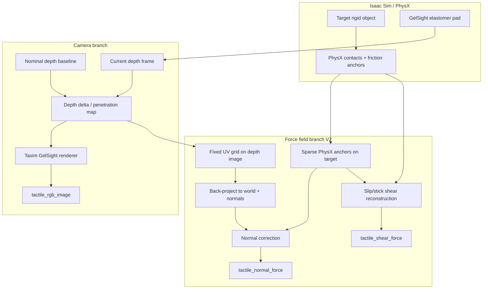

# ViTacSim 原理与架构说明

本文档面向 **co-author / 新机器部署 / release 说明**，系统介绍 ViTacLab 中 ViTacSim（VisuoTactile 触觉仿真）的设计原理、数据流、与 PhysX 的关系，以及如何在新环境复现。

配套文档：

- **打包与部署**：[`README_send.md`](../README_send.md)、[`docs/vitacsim_pack/README.md`](vitacsim_pack/README.md)
- **PhysX 验证**：[`VITACSIM_PHYSX_VALIDATION.md`](VITACSIM_PHYSX_VALIDATION.md)

---

## 1. ViTacSim 是什么

**ViTacSim** 指 ViTacLab 中基于 **TacSL / GelSight** 的 **视觉-触觉联合仿真**，核心实现为 `VisuoTactileSensor`（V1）与 `VisuoTactileSensorV2`（V2）。

| 模块 | 路径 | 作用 |
|------|------|------|
| 传感器 V1 | `assets/sensor/tacsl_sensor/visuotactile_sensor.py` | SDF 查询 + 相机 depth → 力场 + RGB 触觉图 |
| 传感器 V2 | `assets/sensor/tacsl_sensor/visuotactile_sensor_v2.py` | **Depth + PhysX sparse anchors** → 力场 + RGB 触觉图 |
| 配置 | `visuotactile_sensor_cfg.py` | GelSight 渲染、力场、PhysX 归因 flags |
| Taxim 渲染 | `visuotactile_render.py` | depth delta → 逼真 GelSight RGB（Taxim 方法） |
| Shadow Hand 集成 | `assets/sensor/shadow_hand_tacsl.py` | 五指 GelSight 布局与 scene cfg |

**输出（每帧、每 sensor）：**

- `tactile_rgb_image` — GelSight 风格 RGB（240×320 或配置分辨率）
- `tactile_normal_force` — 法向力场（默认 20×25 grid）
- `tactile_shear_force` — 切向力场（20×25×2）
- depth / contact mask 等 debug 量

---

## 2. 两版本传感器：V1 vs V2

### 2.1 VisuoTactileSensor V1（SDF 路径）

**力场来源**：对配置的目标物体做 **GPU SDF 查询**，计算 penetration depth，再施加 penalty spring-damper 模型：

- 法向：\( F_n = k_n \cdot \text{depth} \)
- 切向：Coulomb 摩擦 + tangential stiffness，\( F_t = \min(k_t \|v_t\|, \mu F_n) \)

**特点：**

- 需要目标物体 **预计算 SDF collision mesh**
- 不依赖 PhysX contact view
- 用于 **pretraining** 任务（mass/friction/pose 等 GelSight finger 标定环境）

**局限：** SDF 按 prim 绑定；运行时换物体需重建 view；多物体场景 attribution 依赖 SDF 目标选择。

### 2.2 VisuoTactileSensorV2（Depth + PhysX，论文主路径）

**力场来源**：两阶段 pipeline（见下节）。相对 V1：

- **不再** 调用 `create_sdf_shape_view` / `get_sdf_and_gradients`
- 用 **内参相机 depth delta** 估计形变
- 用 **PhysX RigidContactView** 的 sparse contact/friction anchors 做法向修正与切向重建
- 支持 **strict target attribution**（干扰物接触时不误算到目标物体）

**生产任务（Forge DexHand 等）默认使用 V2**，并开启 strict PhysX flags。

---

## 3. V2 数据流（原理图）



### 3.1 相机 / RGB 分支（与物体归因无关）

1. 仿真开始前渲染 **nominal depth**（无接触 baseline）。
2. 每帧读取 elastomer 内参相机 depth。
3. `penetration = z_nominal - z_current`。
4. **Taxim**（`visuotactile_render.py`）用 Isaac Lab Nucleus 下 `{ISAACLAB_NUCLEUS_DIR}/TacSL/<sensor>/` 的 `bg.jpg`、`polycalib.npz` 合成 RGB。

> **任意物体** 压 pad 都会在 depth/RGB 上产生可见响应；这 **不能** 单独证明力场归因正确。

### 3.2 力场分支（V2 核心）

1. 在 depth 上固定 **20×25 UV 采样格**。
2. 用相机内参 + pose 反投影到世界坐标，有限差分估计局部法向。
3. 从 PhysX 读取 **目标物体** 与 pad 的 contact points、法向力、friction anchors（sparse）。
4. **Normal correction**：用 sparse Fn 锚点修正 depth 驱动的法向力幅值/分布。
5. **Shear reconstruction**：用 friction anchor + 相对切向速度重建 stick/slip 切向力。

**Rigid vs deformable：**

- Rigid：PhysX contact view + 刚体速度 \( v = v_{lin} + \omega \times r \)
- Deformable：`SoftBodyView` 最近顶点速度（`contact_object_is_deformable=True`）

---

## 4. PhysX 归因与 Fallback 语义

详见 [`VITACSIM_PHYSX_VALIDATION.md`](VITACSIM_PHYSX_VALIDATION.md)。此处摘要：

| Flag | 含义 |
|------|------|
| `use_physx_sparse_anchors=True` | 力场使用 PhysX sparse 路径 |
| `require_physx_sparse_anchors=True` | Init 时 PhysX view 失败 → **abort**（禁止 silent dense fallback） |
| `strict_target_contact_attribution=True` | 无目标 PhysX anchor 的帧 → **目标力场置零** |

**「没有 fallback」** 在 release 语境下指：

1. 严格配置下不会静默退回 depth-only dense anchoring；
2. 干扰物接触时不会在目标通道产生虚假力（`interference_only` case 定量验证）。

Forge DexHand cfg（`ur10e_shadowhand_forge_env_cfg.py`）中三个 flag 均为 `True`。

---

## 5. 机器人与场景集成

### 5.1 UR10e + Shadow Hand（五指 GelSight）

- Robot USD：`assets/data/Robots/ShadowHand/ur10e/ur10e_shadow_left_hand_glb_withtac_v2_no_gelsight_articulation.usd`
- Scene 配置：`assets/robot/ur10e_shadowhand_direct_base_single/ur10e_shadowhand_direct_base_cfg.py`
- 五指 sensor 命名顺序（**稳定语义，勿改序**）：

  `tactile_sensor_ff, lf, mf, rf, th` → 对应 `ff/lf/mf/rf/th` 指

- TacSL policy：`TacSLSensorPolicyCfg` — 渲染分辨率、PhysX flags、contact object expr

### 5.2 Forge 任务（Factory + ViTacSim）

| 层级 | 路径 | 说明 |
|------|------|------|
| Franka 简版 | `tasks/direct/simple_gripper/forge_*` | 双指 GelSight Mini，Factory peg/gear/nut |
| UR10e DexHand | `tasks/direct/medium_dexhand/forge_dexhand/` | 五指 GelSight R15，严格 PhysX |

Factory 物体 USD 来自 **Isaac Lab `isaaclab_tasks` Factory 扩展**（Nucleus），不在 ViTacSim pack 的 `Objects/` 里。

### 5.3 Pretraining（V1）

`tasks/direct/pretraining/` — GelSight finger 质量/摩擦/位姿预训练，使用 **V1 SDF** 路径，**不包含** V2 PhysX sparse 验证范围。

---

## 6. 本地资产清单

打包脚本 `bash_command/vitacsim_pack.sh` 会包含：

| 资产目录 | 内容 |
|----------|------|
| `assets/data/Sensors/Gelsight_finger/` | 对齐 benchmark 用短指 USD |
| `assets/data/Sensors/GelSight_R15/` | R15 指端 sensor |
| `assets/data/Sensors/GelSight_Mini/` | Mini sensor + calib |
| `assets/data/Sensors/GelSight_Hand/` | Hand 网格（obj/mtl） |
| `assets/data/Robots/ShadowHand/` | UR10e + Shadow Hand |
| `assets/data/Robots/Franka/GelSight_Mini/` | Franka + Mini 适配 |

**不包含（体积/非必需）：**

- `assets/data/Scene/` (~4 GB)
- `assets/data/Objects/` (~1.7 GB)

**外部依赖（新机器需已有）：**

- Isaac Lab Nucleus **TacSL** 渲染标定数据
- Factory task 资产（Isaac Lab 安装）

---

## 7. 验证与 Demo 体系

### 7.1 定量：PhysX 对齐（6 cases）

```bash
bash bash_command/visuotactile_physx_alignment_check.sh
```

脚本：`scripts/demo/eval_visuotactile_physx_alignment.py`  
输出：`logs/alignment_visuotactile_v2/alignment_summary.json`

### 7.2 可视化：干扰归因 A/B

```bash
STRICT=0 OUT_VIDEO=logs/.../loose.mp4 bash bash_command/visuotactile_alignment_visual.sh
STRICT=1 OUT_VIDEO=logs/.../strict.mp4 bash bash_command/visuotactile_alignment_visual.sh
```

### 7.3 任务级：Forge 触觉插入

```bash
bash bash_command/forge_tactile_feedback_insert_demo.sh
```

### 7.4 Mentor 报告包

```bash
bash bash_command/vitacsim_report_pack.sh
# 可选归因对比：INCLUDE_ATTRIBUTION=1 bash bash_command/vitacsim_report_pack.sh
```

### 7.5 V2 机制 Ablation

```bash
bash bash_command/visuotactile_v2_ablation.sh
```

---

## 8. 新机器部署步骤（摘要）

完整步骤见打包内 `README_PACK.md`。

1. 安装 **Isaac Sim 5.1 + Isaac Lab**（与开发机同 major version）。
2. 解压 `vitacsim_pack_*.tar.gz`，rsync 到 ViTacLab 仓库根目录。
3. `cd source/ViTacLab && python -m pip install -e .`
4. 设置 `PYTHONPATH` 或使用 `isaaclab.sh -p` 启动。
5. 依次跑 §7 的 smoke tests。

**常见依赖：**

```bash
python -m pip install Pillow==11.3.0   # alignment / video 脚本
```

---

## 9. 与数据采集 / Policy 的接口

任务 env 通过 scene cfg 挂载 `VisuoTactileSensorV2Cfg`，env step 后读取：

```python
sensor.data.tactile_rgb_image       # (N, H, W, 3)
sensor.data.tactile_normal_force    # (N, n_points)
sensor.data.tactile_shear_force     # (N, n_points, 2)
```

UR10e 五指顺序见 `UR10E_SHADOWHAND_TACTILE_SENSOR_SPECS` — **collector / RL / DP 必须保持同一 sensor key 顺序**。

NPZ 录制与 panel 可视化在 `scripts/data_collection/` 与 `scripts/demo/render_replay_record_video.py`；离线 visualize 的 RGB fallback **仅用于显示**，不改变仿真力场路径。

---

## 10. 对外表述建议（论文 / Battle）

**Short（英文）：**

> ViTacSim couples GelSight-style tactile imaging (Taxim rendering from depth) with PhysX-grounded force fields (VisuoTactileSensorV2). Sparse contact and friction anchors on the configured manipulation target drive normal and shear reconstruction; strict attribution suppresses false activation under non-target contact. Alignment is validated by a six-case PhysX benchmark including an interference-only scenario.

**中文：**

> ViTacSim 将 GelSight 触觉成像（depth + Taxim 渲染）与基于 PhysX 接触/摩擦锚点的力场重建（V2）结合；严格模式下力场由目标物体 PhysX 接触门控，避免干扰物误归因；并通过六组 scripted case（含 interference-only）定量验证与 PhysX 的对齐。

---

## 11. 文件索引

| 类型 | 路径 |
|------|------|
| V2 实现 | `source/ViTacLab/ViTacLab/assets/sensor/tacsl_sensor/visuotactile_sensor_v2.py` |
| V1 实现 | `.../visuotactile_sensor.py` |
| 配置 | `.../visuotactile_sensor_cfg.py` |
| Forge DexHand | `.../tasks/direct/medium_dexhand/forge_dexhand/` |
| 打包脚本 | `bash_command/vitacsim_pack.sh` |
| 路径清单 | `docs/vitacsim_pack/PATHS.include` |
| PhysX 验证 doc | `docs/VITACSIM_PHYSX_VALIDATION.md` |

---

*Document version: 2026-08-05 · ViTacLab internal*
