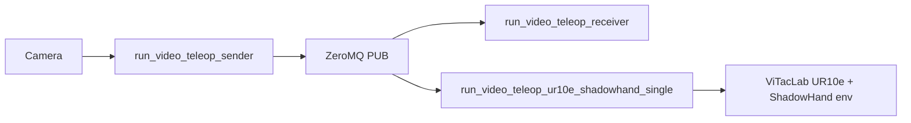

# Video teleoperation — launch scripts

本目录提供 **从命令行启动** 视频遥操作相关程序的入口脚本；核心库在仓库 `source/video_teleop/`。

## 文档

| 文档 | 内容 |
|------|------|
| [QUICK_START.md](./QUICK_START.md) | 环境、标定、双终端启动流程与常见问题 |
| [../../../source/video_teleop/docs/README.md](../../../source/video_teleop/docs/README.md) | 包结构说明与工程文档索引 |
| [../../../source/video_teleop/docs/ENGINEERING_SUMMARY.md](../../../source/video_teleop/docs/ENGINEERING_SUMMARY.md) | 架构、数据流与坐标约定（偏工程） |

## 脚本一览

| 脚本 | 环境 | 说明 |
|------|------|------|
| `list_cameras.py` | `video_teleoperator` | 探测本机可用的 OpenCV 摄像头索引 |
| `camera_calibration.py` | `video_teleoperator` | 棋盘格标定，写出 `config/camera_calibration.yaml` |
| `run_video_teleop_sender.py` | `video_teleoperator` | 摄像头 + MediaPipe → ZMQ PUB |
| `run_video_teleop_receiver.py` | Isaac Lab | ZMQ SUB → 打印或 Isaac 中可视化（不控机器人） |
| `run_task/run_video_teleop_ur10e_shadowhand_single.py` | Isaac Lab | ZMQ + IK → UR10e + Shadow Hand 任务环境 |

## 配置目录

`config/` 下版本化标定文件（路径由 `video_teleop.config_paths` 解析为默认路径）：

- `camera_calibration.yaml` — 相机内参与畸变
- `hand_calibration.yaml` — 人手到 Shadow Hand 关节范围映射

## 依赖关系（简要）

从仓库根目录运行脚本时，入口脚本会把 `source/` 加入 `PYTHONPATH`，以便 `import video_teleop`。
